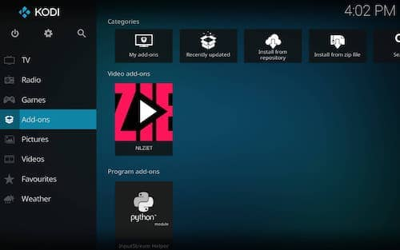
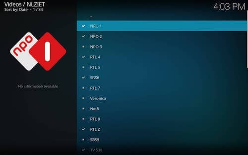

# notice, this addon is work in progress, favourites currently only list, playback do not work, DRM/widevine implementation still in progress

# NLZIET plugin for Kodi
This plugin is not officially supported by NLZIET.
A subscription on NLZIET is required.

This plugin makes it possible to watch live television provided by NLZIET in Kodi.

## Preview

## Installation
1. [Download](https://github.com/iamdevnl/plugin.video.nlziet/archive/master.zip) this addon (ZIP).
2. Go to Add-ons -> Install from zip file.
3. Locate the ZIP file you just downloaded and click on it.
4. Go to Add-ons -> My add-ons.
5. Go to Video add-ons and click on NLZIET.
6. Enter your NLZIET credentials and click on OK.
7. Click on Open and choose your favourite TV channel.

## Licence
Licenced under The MIT License.
